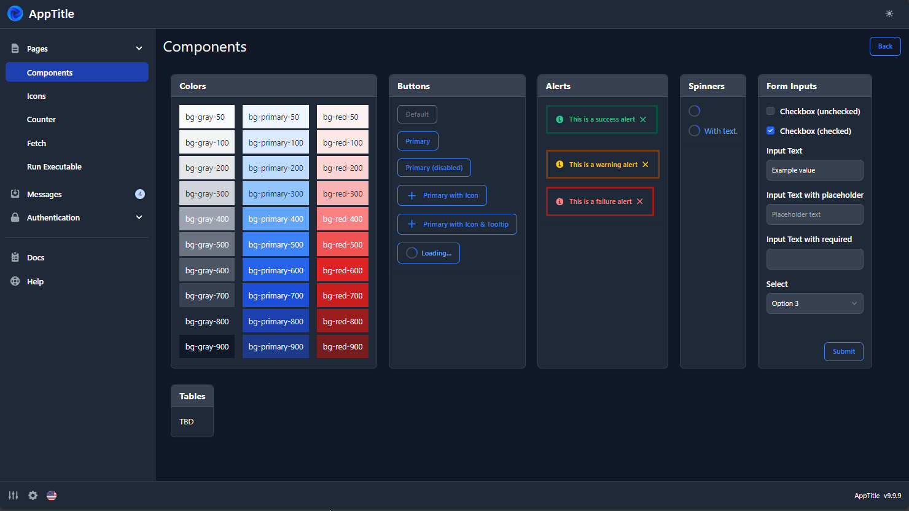

# Python Desktop Starter using Flowbite, Flask, and Jinja <!-- omit in toc -->

    

Start delivering small, slick, cross-platform desktop application with this starter repo utilizing
python's Flask and the [jinja-flowbite](https://pypi.org/project/jinja-flowbite/) Jinja package.

## Table of Contents <!-- omit in toc -->

- [1. Overview](#1-overview)
- [2. Setup Development Environment](#2-setup-development-environment)
    - [2.1. Toolchain](#21-toolchain)
    - [2.2. VSCode Extensions](#22-vscode-extensions)
    - [2.3. Install the Python Library Dependencies](#23-install-the-python-library-dependencies)
    - [2.4. Install Nodejs Dependencies](#24-install-nodejs-dependencies)
    - [2.5. Install git-hooks](#25-install-git-hooks)
- [3. Development](#3-development)
    - [3.1. Desktop Development](#31-desktop-development)
- [4. Distribution (Local)](#4-distribution-local)

## 1. Overview

The desktop application consists of a server-side, python webapp displayed in a native WebView
control and distributed as a single, standalone executable

The tech stack is intentionally simple and approachable such that any intermediate software engineer
should be able to pickup, experiment, and go quickly.

Use the [Discussion section](/discussions) for questions, suggestions and issues.

__Tech Stack:__

- The Interactive SSR WebApp:
    - [html](https://www.w3schools.com/html/) + [tailwindcss](https://tailwindcss.com/) form the foundations of the web page
    - [flowbite](https://flowbite.com/) component library using tailwindcss and `html attributes` for simple interactivity
    - [htmx](https://htmx.org/) sprinkles `html attributes` to add islands of interactivity to a page
    - [flask](https://flask.palletsprojects.com/en/3.0.x/) + [jinja](https://jinja.palletsprojects.com/en/3.1.x/) to build and serve the web page via HTML templates
- The Desktop
    - [pywebview](https://pywebview.flowrl.com/) for hosting the python webapp in a native desktop window
    - [pyinstaller](https://pyinstaller.org/en/stable/) for bundling the application into a standalone, single file exe

## 2. Setup Development Environment

### 2.1. Toolchain

- Install python 3.11 or newer
- Install Nodejs LTS (`currently v20.9.0`)
- Visual Studio Code

### 2.2. VSCode Extensions

- Pylance: `ms-python.vscode-pylance`
- Tailwind CSS Intellisense: `bradlc.vscode-tailwindcss`
- Jinja: `wholroyd.jinja`
- Jinja2 Snippet Kit: `wyattferguson.jinja2-snippet-kit`
- BetterJinja: `samuelcolvin.jinjahtml`
- Markdown All in One: `yzhang.markdown-all-in-one`
- markdownlint: `davidanson.vscode-markdownlint`

### 2.3. Install the Python Library Dependencies

~~~sh
python -m venv venv
.\venv\Scripts\activate # windows
source ./venv/bin/activate # linux
pip install -r requirements.txt
~~~

### 2.4. Install Nodejs Dependencies

This is Flowbite and Tailwind CSS minification.

~~~sh
npm install
~~~

### 2.5. Install git-hooks

~~~sh
.\tools\git-hooks\install_git_hooks.ps1
~~~

## 3. Development

Development consists of two `parallel` command-line tools running simultaneously.

1. tailwindcss minification

    ~~~sh
    npm run watchcss
    ~~~

1. flask web server

    ~~~sh
    .\venv\Scripts\activate
    npm run webdev
    ~~~

With the above vscode extensions installed, one may set breakpoints and run via the vscode debugger by pressing the F5 key.

### 3.1. Desktop Development

~~~sh
.\venv\Scripts\activate
npm run desktop
~~~

## 4. Distribution (Local)

> WARNING. Distributable executables should be created by a CICD pipeline.

1. If needed, update the version found in `build.ps1` or `build.sh` file
1. From a terminal run the following command to build the single file, standalone exe:

    ~~~sh
    .\venv\Scripts\activate # only run if the venv is not active
    npm run dist            # for windows, use `distnix` for linux and osx
    ~~~

    - The `/dist` directory contains the build .exe
    - The `desktop.spec` file may be tailored to your application's needs.
